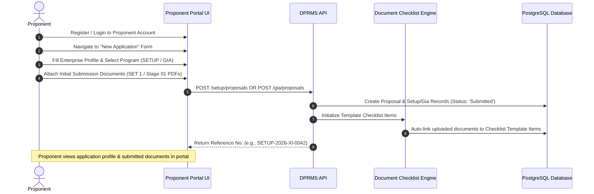
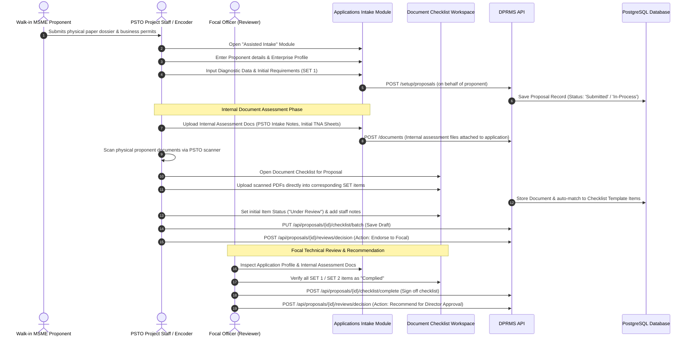
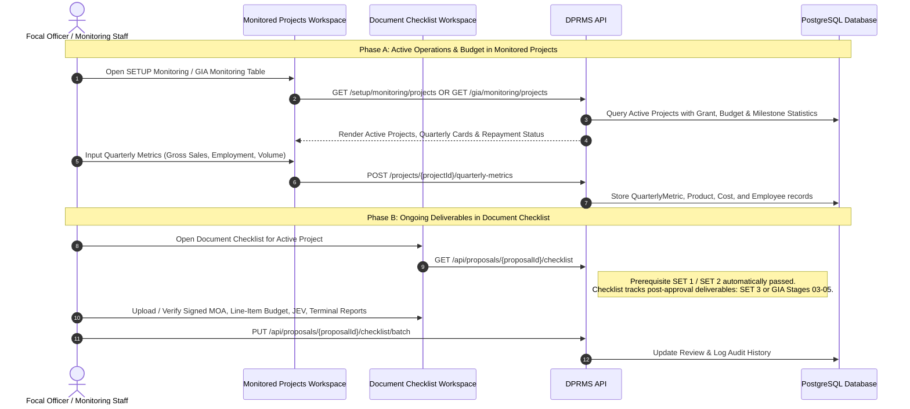

# DOST DPRMS - Dual Intake, Checklist Verification & Monitoring Handover Workflow

**System:** DOST Project and Resource Management System (DPRMS)  
**Target Agency:** Department of Science and Technology (DOST) - Region XI / Provincial Science and Technology Offices (PSTO)  
**Scope:** Multi-Channel Proposal Intake, Application Profile & Initial Document Assessment, Master Checklist Integration, and Monitored Projects Lifecycle  

---

## 1. Executive Summary & Three-Tier System Architecture

The DPRMS architecture establishes a clean, distinct separation between the three operational phases of a project's lifecycle:

```
┌─────────────────────────────────────────────────────────────────────────────────────────────────┐
│                                  DPRMS OPERATIONAL ARCHITECTURE                                 │
├───────────────────────────────┬─────────────────────────────────┬───────────────────────────────┤
│ TIER 1: APPLICATIONS MODULE   │ TIER 2: DOCUMENT CHECKLIST      │ TIER 3: MONITORED PROJECTS    │
│ (Application Info, Initial    │ (Master Lifecycle Compliance    │ (Active Operations, Budgets,  │
│ Submission Docs & Assessment) │ Repository & Proponent Files)   │ Repayments & Metrics)         │
├───────────────────────────────┼─────────────────────────────────┼───────────────────────────────┤
│ • Full Application Profile    │ • Master repository connecting  │ • Financial Budgets & LIB     │
│   (Enterprise info, Sector)   │   proponent uploads to SETs     │ • Quarterly Metric Reports    │
│ • Initial Required Submission │ • Full view of SET 1, 2, 3      │ • Repayment / Refund Ledger   │
│   Docs (SET 1 / Stage 01)     │ • Stages 01 to 05 (GIA)         │ • Equipment tracking & QR     │
│ • "In-Process", "Under Review"│ • Active / approved project     │ • Milestone progress          │
│ • Internal Assessment Docs &  │   verification compliance       │ • Monitoring handover         │
│   TNA diagnostic evaluations  │                                 │                               │
└───────────────────────────────┴─────────────────────────────────┴───────────────────────────────┘
```

---

## 2. Tier 1 Details: What is Included in the Applications Module?

The **Applications Module** contains everything needed for initial intake and pre-qualification:

1. **Application Profile Information:**
   - Proponent contact & organization details.
   - Enterprise classification (Micro, Small, Medium), years in operation, industry sector.
   - Physical address, district, facility ownership (Owned / Rented), and requested DOST assistance.

2. **Initial Submission Documents (Passed by Proponent for Review):**
   - **For SETUP:** Initial **SET 1** documents passed by the proponent for assessment prior to Technology Needs Assessment (TNA) — *Letter of Intent, Mayor's Permit, DTI/SEC, BIR 2303, Blank Official Receipt, 3 Equipment Quotes, Financial Statements*.
   - **For GIA:** Initial **Stage 01** documents passed by the proponent for evaluation — *DOST Form 4.A/4.B Proposal, DOST Form 5 Workplan, DOST Form 6 LIB, PSTO Endorsement, Eligibility Checklist*.

3. **Internal Review & Assessment Documents:**
   - Uploaded by PSTO Staff / Focal Evaluator: *PSTO Intake Assessment Sheet, Pre-TNA Diagnostic Notes, Site Visit Findings, Internal Endorsement Memos*.

---

## 3. Channel 1: Online Proponent Self-Service Workflow

Target User: Proponents with internet access submitting applications independently through the portal.



---

## 4. Channel 2: PSTO Assisted Walk-In Desk Intake & Internal Documents Workflow

Target User: Remote MSMEs or community leaders visiting PSTO with physical paper folders.



---

## 5. Channel 3: Pre-Existing & Ongoing Monitored Projects Workflow

Target User: Active, already-approved projects undergoing execution, monitoring, and repayment.



---

## 6. Architectural Alignment Across the Three Tiers

| Operational Aspect | Tier 1: Applications Module | Tier 2: Document Checklist Module | Tier 3: Monitored Projects Module |
| :--- | :--- | :--- | :--- |
| **Primary Scope** | **Application Intake & Pre-TNA Review:**<br>• Enterprise Profile & Application Data<br>• Initial Submission Files (SET 1 / Stage 01)<br>• Internal Assessment Docs & Notes | **Master Compliance Repository:**<br>• Connects all Proponent Uploads to standard SETs<br>• Full view of SET 1, SET 2, SET 3 / Stages 01–05<br>• Post-approval official verification | **Active Operations & Financials:**<br>• Active Project Budgets & Approved LIB<br>• Repayment & Refund Amortization<br>• Quarterly Metric Reports<br>• Equipment QR Inspections |
| **Stage Scope** | Intake, In-Process, Under Review, Pre-TNA | Complete Lifecycle (SET 1, SET 2, SET 3 / Stages 01–05) | Post-Approval Active Monitoring & Execution |
| **Documents Handled** | **Application Profile + Initial Submission Docs** (SET 1 / Stage 01) + **Internal Assessment Notes** | **All Verified Compliance Documents** (DTI/SEC, FS, Mayor's Permit, MOA, LIB, JEV, Reports) | **Operational Records** (Receipts, inspection photos, equipment logs) |
| **Responsible Roles** | Proponent, Project Staff, Focal Reviewer | Project Staff, Focal Reviewer, Provincial Director | Focal Evaluator, Provincial Director, RPMO |

---

## 7. Backend API Architecture Across the Lifecycle

### 7.1 Intake & Application Endpoints
- `POST /setup/proposals`: Creates SETUP proposal with profile info and initial files (Proponent or Staff assisted).
- `POST /gia/proposals`: Creates GIA proposal with profile info and initial files (Proponent or Staff assisted).
- `POST /documents`: Uploads files and attaches to proposal (Initial proponent files & Internal Assessment docs).

### 7.2 Document Checklist Endpoints
- `GET /api/proposals/{id}/checklist`: Computes and returns dynamic checklist with uploaded documents and compliance stats.
- `PUT /api/proposals/{id}/checklist/batch`: Debounced batch saving of item statuses and overall remarks.
- `PUT /api/proposals/{id}/checklist/items/{itemId}`: Single item status and review decision.
- `POST /api/proposals/{id}/checklist/complete`: Official completion lock and sign-off.
- `GET /api/proposals/{id}/checklist/history`: Chronological audit log.

### 7.3 Technical Review & Executive Decision Endpoints
- `POST /api/proposals/{id}/reviews/decision`: Workflow state transitions (`RETURN_FOR_REVISION`, `ENDORSE_TO_FOCAL`, `RECOMMEND_APPROVAL`, `DIRECTOR_APPROVE`, `DIRECTOR_DISAPPROVE`).

### 7.4 Project Monitoring & Metric Endpoints
- `GET /api/setup/monitoring/projects`: Active SETUP projects list with quarter context and refund statistics.
- `GET /api/gia/monitoring/projects`: Active GIA projects list with grant milestones and semestral progress.
- `POST /api/projects/{projectId}/quarterly-metrics`: Saves quarterly product, cost, and employment data.
