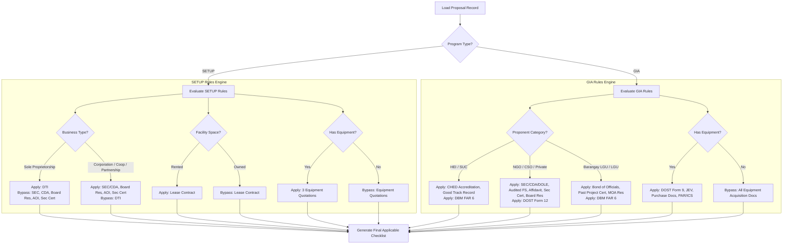

# DOST DPRMS - Enterprise Document Checklist & Verification Workflow Specification

**System:** DOST Project and Resource Management System (DPRMS)  
**Target Agency:** Department of Science and Technology (DOST) - Region XI / Provincial Science and Technology Offices (PSTO)  
**Standard Compliance:** ISO 9001:2015 Quality Management System (QMS) & WCAG 2.1 Level AA Accessibility Standards  

---

## 1. Executive Summary & Purpose

The **Document Checklist & Verification Module** is the core verification engine within the DOST DPRMS. It manages, tracks, and audits documentary requirements across the lifecycle of DOST programs.

> [!IMPORTANT]
> **Program-Specific File Sets:** Documentary requirements are strictly segregated and structured according to the program domain:
> - **SETUP (Small Enterprise Technology Upgrading Program):** Organized into **SET 1, SET 2, and SET 3** (MSME-focused).
> - **GIA (Grants-In-Aid):** Organized into **Stages 01 through 05** (R&D, Community-based, HEI, LGU, and NGO-focused).

```
┌────────────────────────────────────────────────────────────────────────────────────────┐
│                              DOST DPRMS CHECKLIST MODULE                               │
├────────────────────────────────────────────────────────────────────────────────────────┤
│  PROGRAM DOMAIN SELECTOR: [ 🏭 SETUP (MSMEs) ]  |  [ 🔬 GIA (R&D / Grants) ]           │
├────────────────────────────────────────────────────────────────────────────────────────┤
│  SETUP WORKFLOW (SET-BASED):                                                           │
│  ├─ SET 1: Prior to Conduct of TNA (Eligibility & Diagnostic Requirements)             │
│  ├─ SET 2: During Proposal Preparation (Signatory & Profile Requirements)              │
│  └─ SET 3: Post-Approval & Deliberation (Fund Release & Legal Requirements)             │
├────────────────────────────────────────────────────────────────────────────────────────┤
│  GIA WORKFLOW (STAGE-BASED):                                                           │
│  ├─ Stage 01: Proposal Submission, Evaluation, and Approval                            │
│  ├─ Stage 02: Releasing of Project Funds (MOA & CFA)                                   │
│  ├─ Stage 03: Project Monitoring & Field Evaluation                                    │
│  ├─ Stage 04: Extension, Realignment & Reprogramming                                    │
│  └─ Stage 05: Project Liquidation, Property Transfer & Terminal Completion             │
└────────────────────────────────────────────────────────────────────────────────────────┘
```

---

## 2. Program-Specific Document Sets & Requirements Catalog

### 2.1 SETUP Program Requirements (Set-Based Structure)

Target Beneficiaries: Micro, Small, and Medium Enterprises (MSMEs).

| Phase Code | Phase Name & Timing | Count | Required Documents Catalog | Applicability Rules |
| :--- | :--- | :---: | :--- | :--- |
| **SET 1** | **Prior to Conduct of TNA**<br>*(Diagnostic & Eligibility)* | 20 | 1. Filled-out TNA Form 01<br>2. GAD Assessment (GWP)<br>3. GAD Checklist for S&T Interventions<br>4. Hazard Hunter Assessment<br>5. Recent Mayor's Permit<br>6. DTI Registration<br>7. BIR Registration (Form 2303)<br>8. Photocopy of Blank Official Receipt<br>9. 3 Signed Equipment Quotations<br>10. Lease Contract for Rented Space<br>11. Notarized Board Resolution<br>12. SEC / CDA Registration<br>13. Articles of Incorporation / Cooperation<br>14. Secretary's Certificate of Officers<br>15. Statement of Financial Position (A)<br>16. Statement of Financial Operation (B)<br>17. Statement of Cash Flows (C)<br>18. Statement of Changes in Equity (D)<br>19. Notes to Financial Statements (E)<br>20. Letter of Intent with Refund Commitment | • DTI: Sole Proprietorship only<br>• Board Res, SEC/CDA, AOI, Sec Cert: Corp / Coop / Partnership only<br>• Lease Contract: Rented space only<br>• Quotations: Proposals with equipment outlay |
| **SET 2** | **During Proposal Preparation**<br>*(Dossier Formulation)* | 5 | 1. Bio-Data of Approved Signatory<br>2. Valid Gov't ID with 3 specimen signatures<br>3. Barangay Residence Certification<br>4. Omnibus Sworn Affidavit (5-point compliance)<br>5. Accomplished TNA Form 4 | Mandatory for all SETUP proposals |
| **SET 3** | **Post-Approval & Deliberation**<br>*(Release & Legal Setup)* | 13 | 1. Request for Release of Funds<br>2. LBP Account Tagging Waiver & Authorization<br>3. Payee Data Form<br>4. Notarized and Signed MOA<br>5. Pre-Project Implementation Sheet<br>6. Notice of Approval<br>7. Approved Line-Item Budget (LIB)<br>8. Recommending Approval of ARD<br>9. PSTO Endorsement Letter<br>10. Final Copy of Project Proposal<br>11. RTEC Evaluation Report<br>12. Candidate Risk Register<br>13. SETI Scorecard | Mandatory after executive proposal approval |

---

### 2.2 GIA Program Requirements (Stage-Based Structure)

Target Beneficiaries: Higher Education Institutions (HEIs/SUCs), LGUs, Non-Government Organizations (NGOs/CSOs/POs), and Private Sector.

| Stage Code | Stage Name & Scope | Count | Required Documents Catalog | Applicability Rules |
| :--- | :--- | :---: | :--- | :--- |
| **Stage 01** | **Proposal Submission, Evaluation & Approval** | 18 | 1. Letter of Intent signed by Head of IA<br>2. PSTO Endorsement Letter<br>3. Project Leader Eligibility Checklist<br>4. DOST Form 4.A (R&D) / 4.B (Non-R&D)<br>5. DOST Form 6 (LIB with counterpart)<br>6. DOST Form 5 (Workplan)<br>7. RTEC Evaluation Report<br>8. SETI Scorecard<br>9. GAD Checklist<br>10. MOA with Resolution to sign (LGU/NGO)<br>11. Certificate of Funds Availability (CFA)<br>12. CHED Accreditation<br>13. Certification of Good Track Record<br>14. SEC/CDA/DOLE Registration & By-Laws<br>15. Audited Financial Statements (past 3 yrs)<br>16. Sworn Affidavit of No Relationship<br>17. Secretary's Certificate of Officers<br>18. Board Resolution for Engagement | • CHED & Track Record: HEIs/SUCs<br>• SEC/CDA/DOLE, Audited FS, Affidavit, Sec Cert, Board Res: NGOs / CSOs / Private<br>• MOA Resolution: LGUs / NGOs |
| **Stage 02** | **Releasing of Project Funds** | 14 | 1. Request for Release of Funds<br>2. Payee Data Form<br>3. Notarized Memorandum of Agreement<br>4. RTEC Report<br>5. DOST Form 4.B Proposal<br>6. DOST Form 6 (LIB)<br>7. DOST Form 5 (Workplan)<br>8. Certificate of Funds Availability (CFA)<br>9. Letter of Intent<br>10. DOST Form 7 (Clearance on past projects)<br>11. Bond of Barangay Captain & Treasurer<br>12. Barangay Certification of Past Projects<br>13. CHED Accreditation (Updated)<br>14. Certification of Good Track Record | • Bond & Past Project Cert: Barangay LGUs only<br>• CHED & Track Record: HEIs/SUCs |
| **Stage 03** | **Project Monitoring & Field Evaluation** | 12 | 1. DOST Form 10 (Executive Summary of Technical Progress Report)<br>2. DOST Form 8 (List of Personnel Involved)<br>3. DOST Form 9 (Equipment Purchased)<br>4. COA-received DOST Form 11 (Financial Report)<br>5. DOST Form 13 (Schedule of Accounts Payable)<br>6. COA-received Reports of Checks Issued<br>7. COA-received Reports of Disbursements<br>8. DOST Form 12 (Fund Utilization Report - Private)<br>9. DBM URS FAR 6 (Trust Receipts - LGUs/SUCs)<br>10. DOST Form 14 (Report of Income/Interest)<br>11. JEV for Equipment & Depreciation<br>12. DOST Form 15 (Monitoring & Field Eval) | • DOST Form 9 & JEV: Equipment projects only<br>• DOST Form 12: Private / NGOs only<br>• FAR 6: LGUs / SUCs / NGAs only |
| **Stage 04** | **Extension & Reprogramming** | 6 | 1. Request Letter with justification signed by Head of IA<br>2. Endorsement Letter from Monitoring Unit<br>3. Latest DOST Form 11 (Financial Report)<br>4. Latest DOST Form 10 (Technical Report)<br>5. DOST Form 6 (Proposed Realignment LIB)<br>6. Updated DOST Form 5 (Workplan) | Required when project requests extension or budget realignment |
| **Stage 05** | **Liquidation & Property Transfer** | 17 | 1. Endorsement Letter for completion<br>2. DOST Form 11 - Final Updated Financial Report<br>3. DOST Form 18 - Terminal Financial Report (COA stamped)<br>4. COA Reports of Checks & Disbursements<br>5. Official Receipt of Unexpended Balance<br>6. Line-Item Budget Realignment<br>7. DOST Form 8 (Personnel List)<br>8. DOST Form 9 (Equipment List)<br>9. DOST Form 17 (Terminal Accomplishment Report)<br>10. Narrative Report with Photo Documentation<br>11. Proof of Outputs (IP filings, manuscripts, inspection)<br>12. Beneficiaries Acceptance Acknowledgement<br>13. Purchase & Procurement Documents<br>14. Property Acknowledgement Receipt (PAR)<br>15. Inventory Custodian Slip (ICS)<br>16. Certificate of Acceptance (Transferee)<br>17. Certificate of Project Completion | • DOST Form 9, PAR, ICS, Purchase Docs: Equipment transfers |

---

## 3. Dynamic Applicability Evaluation Engine



---

## 4. UI/UX Workspace & Layout Architecture

### 4.1 Program-Aware Workspace Header & Controls

The Document Checklist workspace adapts its UI filters and tabs dynamically according to the selected proposal's program:

```
┌──────────────────────────────────────────────────────────────────────────────────────────────────────┐
│  🏛️ DOST DPRMS  |  Document Checklist & Verification Workspace                                       │
├──────────────────────────────────────────────────────────────────────────────────────────────────────┤
│  📁 PROPOSAL SELECTOR & CONTEXT BAR                                                                  │
│  [ Select Proposal ▾ ]  Program: [ 🏭 SETUP ]  |  Ref: SETUP-2026-XI-018 | Enterprise: Tagum Agro    │
│  Proponent: Juan Dela Cruz (Sole Proprietorship) | Space: Rented | Focal: Engr. Reyes (SETUP Focal) │
│                                                                                                      │
│  Progress: [████████████████████░░░░░░] 70% (14 of 20 Complied)                [ 📜 Activity Log ]   │
├──────────────────────────────────────────────────────────────────────────────────────────────────────┤
│  🏷️ DYNAMIC PHASE TABS (Switches per Program)                                                        │
│  For SETUP: [ All Categories ] [ SET 1: Pre-TNA (15) ] [ SET 2: Proposal (5) ] [ SET 3: Approval (0) ]│
│  For GIA:   [ All ] [ Stage 01 ] [ Stage 02 ] [ Stage 03 ] [ Stage 04 ] [ Stage 05 ]               │
│                                                                                                      │
│  Status Filter: (•) All  ( ) Uploaded  ( ) Pending       Search: [ 🔍 Filter document name... ]      │
│  Layout: [ ☷ Grid View ] [ ☰ List View ]                 Auto-Save: ● All changes saved (2m ago)     │
└──────────────────────────────────────────────────────────────────────────────────────────────────────┘
```

### 4.2 WCAG 2.1 Level AA Accessibility Standards

1. **Focus Management & Keyboard Navigation:**
   - Modals trap keyboard focus (`Tab` / `Shift+Tab`). `Escape` cleanly dismisses preview/review modals.
   - Shortcut hotkeys for fast review: `Ctrl+S` (Force Batch Save), `Alt+A` (Approve Item), `Alt+R` (Return for Revision).
2. **Screen Reader Semantic Trees:**
   - Status indicators use explicit ARIA live regions: `<div aria-live="polite">All changes saved</div>`.
   - Table columns contain explicit header mappings: `<th scope="col">Document Requirement</th>`.
3. **Contrast-Compliant Visual Hierarchy:**
   - Contrast ratio > 4.5:1 across light and dark modes.
   - Statuses use triple cues: distinct background border, iconography (✓, ⏳, ⚠️, ✕, ⊘), and unambiguous text badges.

---

## 5. Role-Based Access Control (RBAC) Matrix by Program & Action

| Capability / Interaction | Proponent | Project Staff (SETUP/GIA) | Focal Evaluator (SETUP/GIA) | Provincial Director | RPMO Viewer | System Admin |
| :--- | :---: | :---: | :---: | :---: | :---: | :---: |
| **Access Checklist Module** (`/document-checklist`) | ❌ | ✅ | ✅ | ✅ | ✅ | ✅ |
| **Program Switching (SETUP ↔ GIA)** | ❌ | Assigned Program Only | Assigned Program Only | ✅ (All Programs) | ✅ (All Programs) | ✅ (All Programs) |
| **View Proposal Checklist & Progress %** | ❌ | ✅ | ✅ | ✅ (Read-only) | ✅ (Read-only) | ✅ |
| **Preview Attached PDF / Images** | ❌ (Internal) | ✅ | ✅ | ✅ | ✅ | ✅ |
| **Upload / Replace Checklist Documents** | ❌ (Internal) | ✅ | ✅ | ❌ | ❌ | ✅ |
| **Update Item Status & Draft Notes** | ❌ | ✅ | ✅ | ❌ | ❌ | ✅ |
| **Perform Formal Item Verification** | ❌ | ✅ (Pre-eval) | ✅ (Official) | ❌ | ❌ | ✅ |
| **Execute Final Review Sign-Off** | ❌ | ❌ | ✅ | ❌ | ❌ | ✅ |
| **Inspect Immutable Activity Audit Log** | ❌ | ✅ | ✅ | ✅ | ✅ | ✅ |

---

## 6. Backend API Endpoint Specifications

| Method | Endpoint Route | Query / Body Payload | Response Object | Success | Error Codes |
| :--- | :--- | :--- | :--- | :---: | :---: |
| `GET` | `/api/document-checklist/templates` | `?program=SETUP` or `?program=GIA` | `data: DocumentChecklistTemplate[]` | `200` | `401`, `403` |
| `GET` | `/api/proposals/{proposalId}/checklist` | None | `data: ProposalChecklistPayload` (items, sets, stats, docs) | `200` | `401`, `403`, `404` |
| `PUT` | `/api/proposals/{proposalId}/checklist/batch` | `{ overall_remarks, items: [...] }` | `data: ProposalChecklistPayload` (recomputed) | `200` | `401`, `403`, `422` |
| `PUT` | `/api/proposals/{proposalId}/checklist/items/{itemId}` | `{ is_present, status, remarks, document_id }` | `data: ProposalChecklistReview` | `200` | `401`, `403`, `422` |
| `POST` | `/api/proposals/{proposalId}/checklist/complete` | `{ final_remarks }` | `data: ProposalChecklistSummary` | `200` | `401`, `403`, `422` |
| `GET` | `/api/proposals/{proposalId}/checklist/history` | None | `data: ProposalChecklistHistory[]` | `200` | `401`, `403`, `404` |
