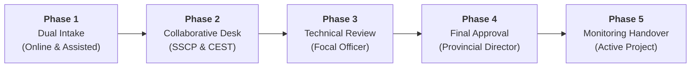
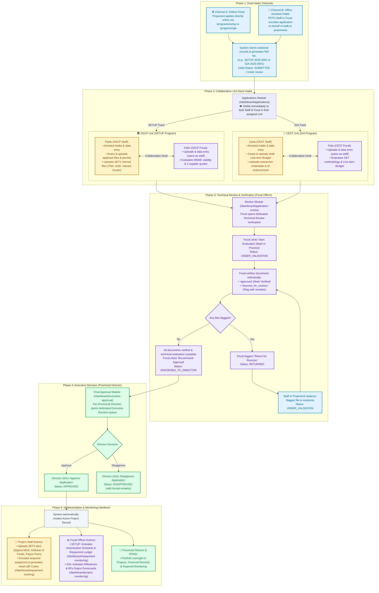

# DOST DPRMS Master Workflow: Application to Monitoring Handover
**Standard Operating Procedure for Proposal Intake, Review, Executive Approval & Handover**  
*Aligned with DOST Davao Region (QMS / ISO Standards) and DPRMS Application Architecture*

---

## 🏛️ Scope & Core Focus

This specification covers the **complete intake-to-handover lifecycle**:
1. **Application Intake:** Dual-channel submission (Online Proponent Portal & PSTO Assisted Walk-in Encoding).
2. **Collaborative Unit Desk Intake:** SSCP Desk (SETUP) and CEST Desk (GIA) concurrent preparation.
3. **Technical Review & Verification:** Focal Officer technical evaluation, document verification, and endorsement.
4. **Executive Decision:** Provincial Director final executive approval / disapproval.
5. **Monitoring Handover:** Automated active project creation and routing to monitoring ledgers.



---

## 👑 Organizational Hierarchy & Role Responsibilities

```
                  ┌───────────────────────────────────────────────────────────┐
                  │          ⚖️ PROVINCIAL DIRECTOR (Executive Level)         │
                  │  • Final Executive Approver (APPROVED / DISAPPROVED)      │
                  │  • Strictly view-only on files; no encoding tasks         │
                  └─────────────────────────────┬─────────────────────────────┘
                                                │ (Receives Endorsed Dossiers)
                  ┌─────────────────────────────▼─────────────────────────────┐
                  │              👑 FOCAL OFFICER (Review & Endorse)          │
                  │  • Assisted intake & data entry (same as staff)           │
                  │  • Scans & uploads (same as staff)                        │
                  │  • Starts Evaluation & verifies documents                 │
                  │  • Triggers revision requests & endorses to Director      │
                  └─────────────────────────────┬─────────────────────────────┘
                                                │ (Collaborative Desk)
                  ┌─────────────────────────────▼─────────────────────────────┐
                  │          📝 PROJECT STAFF (Intake & Uploads)              │
                  │  • Assisted intake & data entry                           │
                  │  • Scans & uploads applicant requirements & internal docs │
                  │  • Pure uploader (no verification or endorsement buttons) │
                  └───────────────────────────────────────────────────────────┘
```

---

## 🗺️ Master Intake-to-Handover Workflow Diagram



---

## 🏢 Unit & Program Desk Separation (SSCP vs. CEST)

DPRMS strictly isolates incoming applications and active projects by program domain:

| Dimension | SSCP Unit (SETUP Program) | CEST Unit (GIA Program) |
| :--- | :--- | :--- |
| **Flagship Focus** | MSME Technological Upgrading & Innovation | Research & Development (R&D), Community S&T (CEST), Grants |
| **Assigned Project Staff** | **Paolo SETUP Staff** (`setup.staff@dost.gov.ph`) | **Carla GIA Staff** (`gia.staff@dost.gov.ph`) |
| **Assigned Focal Officer** | **Faith SETUP Focal** (`setup.focal@dost.gov.ph`) | **Felix GIA Focal** (`gia.focal@dost.gov.ph`) |
| **Target Proponents** | MSMEs, Cooperatives, Food Processors, Manufacturing | State Universities (SUCs), HEIs, LGUs, Community POs, NGOs |
| **Reference Number Format** | `SETUP-YYYY-XXXX` (e.g., `SETUP-2026-0001`) | `GIA-YYYY-XXXX` (e.g., `GIA-2026-0001`) |
| **Project Staff Focus** | Assisted intake & data entry, scans & uploads | Assisted intake & data entry, scans & uploads |
| **Focal Officer Focus** | Upload & data entry, review & evaluate 3 quotes, endorse to PD | Upload & data entry, review & evaluate LIB, endorse to PD |
| **Handover Destination** | Amortization Repayment Ledger & Equipment QR Tagging | Milestone Gantt Chart & **6Ps Output Scorecard** |

---

## 🔒 Master Role-Based Access Control (RBAC) Matrix

| Feature / Operation | Proponent | Project Staff (`PROJECT_STAFF`) | Focal Officer (`FOCAL`) | Provincial Director (`PROVINCIAL_DIRECTOR`) | RPMO Officer (`RPMO`) | System Admin (`SYSTEM_ADMIN`) |
| :--- | :---: | :---: | :---: | :---: | :---: | :---: |
| **Online Proposal Submission** | ✅ | ❌ | ❌ | ❌ | ❌ | ❌ |
| **Assisted Walk-in Encoding** | ❌ | ✅ (Primary) | ✅ (Can do) | ❌ | ❌ | ❌ |
| **View Applications Roster** | 👁️ (Self) | ✅ (Unit Desk) | ✅ (Unit Desk) | 👁️ (All Programs) | 👁️ (All Programs) | 👁️ (All) |
| **Start Evaluation (Mark In Process)**| ❌ | ❌ | ✅ **(Exclusive)** | ❌ | ❌ | ❌ |
| **Upload SET1 Internal Docs** | ❌ | ✅ (Primary) | ✅ (Can do) | ❌ | ❌ | ❌ |
| **Verify Applicant & Internal PDFs** | ❌ | ❌ | ✅ **(Exclusive)** | ❌ | ❌ | ❌ |
| **Flag Documents for Revision** | ❌ | ❌ | ✅ **(Exclusive)** | ❌ | ❌ | ❌ |
| **Replace Flagged Revision Files** | ✅ (Online) | ✅ (Assisted) | ❌ | ❌ | ❌ | ❌ |
| **Recommend Approval (Endorse)** | ❌ | ❌ | ✅ **(Exclusive)** | ❌ | ❌ | ❌ |
| **Executive Final Decision** | ❌ | ❌ | ❌ | ✅ **(Exclusive)** | ❌ | ❌ |
| **Upload Post-Approval MOA & Fund Docs**| ❌ | ✅ (Primary) | ✅ (Can do) | ❌ | ❌ | ❌ |
| **Asset QR Tagging & Registry** | ❌ | ✅ | ✅ | 👁️ (View) | 👁️ (View) | ❌ |
| **Track Physical Milestones & 6Ps** | 👁️ (Self) | ✅ | ✅ **(Lead)** | 👁️ (View) | 👁️ (View) | ❌ |
| **Manage Financial Records / Ledgers**| 👁️ (Self) | ❌ | ✅ **(Lead)** | 👁️ (View) | 👁️ (View) | ❌ |

---

## 🧭 Sidebar Module Layout & Click-Through by Role

```
┌─────────────────────────┐  ┌─────────────────────────┐  ┌─────────────────────────┐  ┌─────────────────────────┐
│   📝 PROJECT STAFF      │  │    👑 FOCAL OFFICER     │  │ ⚖️ PROVINCIAL DIRECTOR  │  │        👁️ RPMO          │
├─────────────────────────┤  ├─────────────────────────┤  ├─────────────────────────┤  ├─────────────────────────┤
│ • Dashboard             │  │ • Dashboard             │  │ • Dashboard             │  │ • Dashboard             │
│ • Applications          │  │ • Applications          │  │ • Applications          │  │ • Applications          │
│ • Equipment & QR        │  │ • Review                │  │ • Final Approval        │  │ • Regional Monitoring   │
│ • Project Monitoring    │  │ • Project Monitoring    │  │ • Financial Records     │  │ • Reports               │
│ • Reports               │  │ • Financial Records     │  │ • Project Monitoring    │  │                         │
│                         │  │ • Reports               │  │ • Reports               │  │                         │
└─────────────────────────┘  └─────────────────────────┘  └─────────────────────────┘  └─────────────────────────┘
```

---

## 🖱️ Step-by-Step Click-Through Journey

### 1️⃣ Initial Intake Stage (`SUBMITTED` / `Under review`)
* **Project Staff clicks $\rightarrow$ 📂 `Applications` (`/dashboard/applications`):**
  * Opens unit queue (SSCP for SETUP / CEST for GIA).
  * Scans & encodes documents for walk-in proponents.
  * Uploads internal SET1 files (TNA Form 1, GAD Checklist, Hazard Hunter).
* **Focal Officer clicks $\rightarrow$ 📂 `Applications` (`/dashboard/applications`):**
  * Sees the incoming application concurrently with Staff.
  * Can assist with uploading/editing files directly.

---

### 2️⃣ Technical Evaluation Stage (`UNDER_VALIDATION` / `In Process`)
* **Focal Officer clicks $\rightarrow$ 🔍 `Review` (`/dashboard/application-review`):**
  * **Dedicated Focal Evaluation Workspace.**
  * Clicks *"Start Evaluation (Mark In Process)"*.
  * Evaluates 3 supplier bids (SETUP) or Line-Item Budget (GIA).
  * Performs document verification (`Mark Verified` / `Needs Revision`).
  * If files need correction: triggers *"Return for Revision"*.
  * Once complete: clicks **"Recommend Approval"** (Endorses to Director).

---

### 3️⃣ Executive Decision Stage (`ENDORSED_TO_DIRECTOR` / `Executive Approval`)
* **Provincial Director clicks $\rightarrow$ ⚖️ `Final Approval` (`/dashboard/executive-approval`):**
  * **Dedicated Executive Queue** (only lists proposals endorsed by Focal).
  * Inspects complete dossier & prints official proposal form.
  * Issues decision: **"Approve Application"** (`APPROVED`) or **"Disapprove"** (`DISAPPROVED`).

---

### 4️⃣ Active Project Handover (`APPROVED` $\rightarrow$ `ACTIVE_PROJECT`)
* **Project Staff clicks $\rightarrow$ 🏷️ `Equipment & QR` & 📈 `Project Monitoring`:**
  * Uploads SET3 files (Signed & Notarized MOA, Release of Funds, Payee Form).
  * Registers equipment serial numbers & generates DOST Asset QR Codes.
* **Focal Officer clicks $\rightarrow$ 📈 `Project Monitoring` & 💰 `Financial Records`:**
  * Tracks milestone progress and scores **6Ps Deliverables** (*Publications, Patents, Products, People, Places, Policies*).
  * Monitors the **Amortization Repayment Ledger** (SETUP) or grant tranches (GIA).
* **Provincial Director clicks $\rightarrow$ 📈 `Project Monitoring` & 💰 `Financial Records`:**
  * High-level portfolio tracking and provincial repayment health.
* **RPMO clicks $\rightarrow$ 🌐 `Regional Monitoring`:**
  * Multi-province analytics and regional budget utilization.

---

## 🔄 State Machine Transition Lifecycle

| Step | State Code | Public Display Badge | Trigger Action | Authorized Persona | Next Stage |
| :---: | :--- | :--- | :--- | :--- | :--- |
| **1** | `SUBMITTED` | `Under review` | Proponent submits online OR Staff encodes walk-in proposal | Proponent / Staff | Desk Intake |
| **2** | `UNDER_VALIDATION` | `In Process` | Focal clicks *"Start Evaluation (Mark In Process)"* | Focal Officer | Technical Evaluation |
| **3** | `RETURNED` | `Returned for Revision` | Focal flags defective document with specific remarks | Focal Officer | Revision Loop |
| **4** | `UNDER_VALIDATION` | `In Process` | Proponent or Staff replaces flagged file & resubmits | Proponent / Staff | Re-evaluation |
| **5** | `ENDORSED_TO_DIRECTOR` | `Executive Approval` | Focal verifies all documents & clicks *"Recommend Approval"* | Focal Officer | Executive Gate |
| **6** | `APPROVED` | `Approved` | Provincial Director clicks *"Approve Application"* | Provincial Director | Monitoring Handover |
| **7** | `DISAPPROVED` | `Disapproved` | Provincial Director clicks *"Disapprove"* with formal reason | Provincial Director | Closed |
| **8** | `ACTIVE_PROJECT` | `Active Project` | Staff uploads MOA & Focal activates ledgers / 6Ps scorecards | Staff & Focal | Active Monitoring |
