# Application & Review Proposals Workflow

This document details the end-to-end logical workflow for **Proposal Submission**, **Staff Rapid Review**, **Internal Documents (TNA/Site Inspection)**, **Focal Evaluation & Document Review**, **Provincial Director Executive Approval**, and the **Handover to Project Monitoring**.

---

## Workflow Diagram

```mermaid
flowchart TD
    %% Roles Styling
    classDef proponent fill:#e0f2fe,stroke:#0284c7,stroke-width:2px,color:#0369a1;
    classDef staff fill:#fef3c7,stroke:#d97706,stroke-width:2px,color:#92400e;
    classDef focal fill:#ede9fe,stroke:#7c3aed,stroke-width:2px,color:#5b21b6;
    classDef director fill:#dcfce7,stroke:#16a34a,stroke-width:2px,color:#15803d;
    classDef monitoring fill:#f1f5f9,stroke:#475569,stroke-width:2px,stroke-dasharray: 5 5,color:#334155;

    subgraph PHASE_1 ["Phase 1: Application Intake (Proponent)"]
        A1["Proponent submits Proposal & Required Documents"]:::proponent
        A2["System generates Proposal PDF snapshot & creates reference number"]:::proponent
        A3["Status: SUBMITTED (Pending)"]:::proponent
        A1 --> A2 --> A3
    end

    subgraph PHASE_2 ["Phase 2: Rapid Review & Internal Uploads (Project Staff)"]
        B1["Project Staff opens application in Review Workspace"]:::staff
        B2["Rapid check of proponent details & attached forms"]:::staff
        B3["Staff marks 'Mark as In Process' -> Status: UNDER_VALIDATION"]:::staff
        B4{"Program Type?"}:::staff
        B5["SETUP: Conduct TNA / Site Visit & Upload SET1 Internal Docs:<br/>- TNA Form 1<br/>- GAD Assessment & Checklist<br/>- Hazard Hunter"]:::staff
        B6["GIA: Verify Project Leader info & Co-authors"]:::staff

        A3 --> B1 --> B2 --> B3 --> B4
        B4 -->|SETUP| B5
        B4 -->|GIA| B6
    end

    subgraph PHASE_3 ["Phase 3: Technical Evaluation & Document Review (Focal)"]
        C1["Focal reviews applicant & internal documents"]:::focal
        C2["Focal verifies each document individually:<br/>'approved' or 'returned_for_revision'"]:::focal
        C3{"Any documents flagged for revision?"}:::focal
        C4["Focal triggers 'Return for Revision'<br/>Status: RETURNED"]:::focal
        C5["Proponent re-uploads flagged documents & Resubmits"]:::proponent
        C6["All mandatory documents verified & TNA complete"]:::focal
        C7["Focal clicks 'Recommend Approval'<br/>Status: ENDORSED_TO_DIRECTOR"]:::focal

        B5 --> C1
        B6 --> C1
        C1 --> C2 --> C3
        C3 -->|Yes| C4 --> C5 --> B2
        C3 -->|No| C6 --> C7
    end

    subgraph PHASE_4 ["Phase 4: Executive Decision (Provincial Director)"]
        D1["Provincial Director reviews endorsed dossier"]:::director
        D2{"PD Decision"}:::director
        D3["Click 'Approve Application'<br/>Status: APPROVED"]:::director
        D4["Click 'Disapprove'<br/>Status: DISAPPROVED"]:::director

        C7 --> D1 --> D2
        D2 -->|Approve| D3
        D2 -->|Disapprove| D4
    end

    subgraph PHASE_5 ["Phase 5: Next Sprint — Project Monitoring Handover"]
        E1["Trigger Project Onboarding Record"]:::monitoring
        E2{"Program Type?"}:::monitoring
        E3["SETUP Project Monitoring:<br/>- Amortization Schedule & Repayment Ledger<br/>- Equipment Registry & Turnover<br/>- Quarterly Progress & Site Visits"]:::monitoring
        E4["GIA Project Monitoring:<br/>- Deliverable Milestones<br/>- Line-Item Budget & Fund Releases<br/>- Progress / Accomplishment Reports<br/>- Evaluation Visits"]:::monitoring

        D3 --> E1 --> E2
        E2 -->|SETUP| E3
        E2 -->|GIA| E4
    end
```

---

## Process Breakdown by Phase

### Phase 1: Application Intake (Proponent)
1. **Submission**: Proponents apply via `/programs/setup/register` or `/programs/gia/register`.
2. **Automated Steps**:
   - Proposal record created with unique reference number (e.g., `SETUP-2026-XXXX` or `GIA-2026-XXXX`).
   - Auto-generates a standardized Proposal PDF form snapshot.
   - Uploads applicant documentary requirements.
   - Sets proposal status to `SUBMITTED`.

### Phase 2: Rapid Review & Internal Uploads (Project Staff)
1. **Rapid Review**: Project Staff opens the incoming proposal in the review workspace and validates applicant eligibility and basic document completeness.
2. **Transition**: Staff clicks **"Mark as In Process"**, updating status to `UNDER_VALIDATION`.
3. **Internal Document Uploads (SETUP Focus)**:
   - Staff conducts the site inspection / Technology Needs Assessment (TNA).
   - Staff navigates to the **Internal Documents** tab and uploads:
     - TNA Form 01
     - GAD (Gender and Development) Assessment & Checklist
     - Hazard Hunter Geo-Hazard Assessment
   - These SET1 documents are required for endorsement.

### Phase 3: Technical Evaluation & Document Review (Focal)
1. **Document-by-Document Verification**:
   - The Focal officer inspects each uploaded document via inline preview or download.
   - Each document is individually marked as `approved` or `returned_for_revision`.
2. **Revision Loop**:
   - If documents are insufficient, Focal enters revision remarks and clicks **"Return to Applicant for Revision"** (`RETURNED`).
   - The proponent receives instructions, replaces the flagged documents, and resubmits (`UNDER_VALIDATION`).
3. **Endorsement**:
   - When all mandatory applicant and internal documents are approved, Focal clicks **"Recommend Approval"** (`ENDORSED_TO_DIRECTOR` / Executive Approval).

### Phase 4: Executive Decision (Provincial Director)
1. **Review**: The Provincial Director reviews the complete dossier endorsed by the Focal.
2. **Final Decision**:
   - **Approve Application** -> Status becomes `APPROVED`.
   - **Disapprove Application** -> Status becomes `DISAPPROVED`.

### Phase 5: Monitoring Handover
Upon approval by the Provincial Director:
- **SETUP Monitoring**: Transitions to tracking amortization schedules, repayment transactions, equipment inventory, and quarterly monitoring reports.
- **GIA Monitoring**: Transitions to deliverable milestone tracking, fund release tranches, cash program logs, and accomplishment reports.

---

## Role & Responsibility Matrix

| Role | Primary Responsibility | UI Actions | Backend API Endpoints |
| :--- | :--- | :--- | :--- |
| **Proponent** | Submits proposal, uploads requirements, resolves revision flags | Submit proposal, view application status, re-upload documents | `POST /proposal/setup` `POST /proposal/gia` `PUT /proposal/{id}/resubmit` |
| **Project Staff** | Initial rapid review, internal site visit/TNA document encoding | "Mark as In Process", upload internal documents (TNA, GAD, Hazard Hunter) | `GET /proposal` `PUT /proposal/advance-stage/{id}` `POST /documents` |
| **Focal** | Technical evaluation, document verification, revision management, endorsement | Review each document (`approved`/`returned_for_revision`), "Return for Revision", "Recommend Approval" | `PATCH /documents/{doc}/review` `PUT /proposal/{id}/return-for-revision` `PUT /proposal/advance-stage/{id}` |
| **Provincial Director** | Final executive authority at provincial level | "Approve Application", "Disapprove" | `PUT /proposal/{id}/approve` `PUT /proposal/{id}/disapprove` |

---

## Status Transition State Machine

| Current Status | Trigger Action | Executed By | Next Status |
| :--- | :--- | :--- | :--- |
| *None* | Submit Proposal | Proponent | `SUBMITTED` |
| `SUBMITTED` | Mark as In Process | Project Staff / Focal | `UNDER_VALIDATION` |
| `UNDER_VALIDATION` | Return for Revision | Focal | `RETURNED` |
| `RETURNED` | Resubmit Revised Documents | Proponent | `UNDER_VALIDATION` |
| `UNDER_VALIDATION` | Recommend Approval / Endorse | Focal | `ENDORSED_TO_DIRECTOR` |
| `ENDORSED_TO_DIRECTOR` | Approve Application | Provincial Director | `APPROVED` |
| `ENDORSED_TO_DIRECTOR` | Disapprove Application | Provincial Director | `DISAPPROVED` |
| `APPROVED` | Onboard to Monitoring *(Next Sprint)* | System / Staff | Active Project (`SETUP` / `GIA`) |
