# Application & Review Proposals Workflow

This document details the end-to-end logical workflow for **Proposal Submission**, **Staff Rapid Review & Internal Uploads**, **Focal Officer Evaluation & Document Verification**, **Provincial Director Executive Approval**, and the **Handover to Project Monitoring** for both **SETUP** and **GIA** programs.

---

## Workflow Diagram

```mermaid
flowchart TD
    %% Roles Styling
    classDef proponent fill:#e0f2fe,stroke:#0284c7,stroke-width:2px,color:#0369a1;
    classDef staff fill:#fef3c7,stroke:#d97706,stroke-width:2px,color:#92400e;
    classDef focal fill:#ede9fe,stroke:#7c3aed,stroke-width:2px,color:#5b21b6;
    classDef director fill:#dcfce7,stroke:#16a34a,stroke-width:2px,color:#15803d;
    classDef monitoring fill:#f1f5f9,stroke:#475569,stroke-width:2px,stroke-dasharray: 5 5,color:#334155;

    subgraph PHASE_1 ["Phase 1: Application Intake & Data Ingestion (Proponent)"]
        A1["Proponent fills Application Form & Uploads Requirements<br/>(/programs/setup/register or /programs/gia/register)"]:::proponent
        A2["System saves structured fields to DB & JSON snapshot<br/>(proposals, setup_proposals / gia_proposals tables)"]:::proponent
        A3["System generates unique Reference Number<br/>(e.g., SETUP-2026-XXXX or GIA-2026-XXXX)"]:::proponent
        A4["Status: SUBMITTED (Pending Review)"]:::proponent
        A1 --> A2 --> A3 --> A4
    end

    subgraph PHASE_2 ["Phase 2: Rapid Review & Internal Uploads (Project Staff / Encoder)"]
        B1["Project Staff opens application in Review Workspace"]:::staff
        B2["Reviews data fields & checks document completeness in Overview tab"]:::staff
        B3["Staff clicks 'Mark as In Process' -> Status: UNDER_VALIDATION"]:::staff
        B4{"Program Type?"}:::staff
        
        %% SETUP Staff Path
        B5["SETUP Staff Actions:<br/>- Conducts Site Visit & Technology Needs Assessment (TNA)<br/>- Uploads SET1 Internal Docs (TNA Form 1, GAD Checklist, Hazard Hunter)"]:::staff
        
        %% GIA Staff Path
        B6["GIA Staff Actions:<br/>- Verifies Project Leader & Co-author credentials<br/>- Checks Institution Endorsement & Line-Item Budget (LIB) completeness"]:::staff

        A4 --> B1 --> B2 --> B3 --> B4
        B4 -->|SETUP| B5
        B4 -->|GIA| B6
    end

    subgraph PHASE_3 ["Phase 3: Program-Specific Evaluation & Verification (Focal Officer)"]
        C1{"Program Assignment"}:::focal
        
        %% SETUP Focal
        C2["SETUP Focal Review:<br/>- Evaluates technical viability, 3 supplier equipment quotes & financial capability<br/>- Inspects TNA findings & GAD score"]:::focal
        
        %% GIA Focal
        C3["GIA Focal Review:<br/>- Evaluates research methodology, work plan milestones & S&T outputs<br/>- Assesses Line-Item Budget (LIB) & counter-part funding"]:::focal

        C4["Focal verifies all submitted & internal documents individually:<br/>'approved' or 'returned_for_revision'"]:::focal
        C5{"Any documents flagged for revision?"}:::focal
        C6["Focal enters revision comments & triggers 'Return for Revision'<br/>Status: RETURNED"]:::focal
        C7["Proponent replaces flagged documents & Resubmits<br/>Status: UNDER_VALIDATION"]:::proponent
        C8["All mandatory documents verified & technical evaluation complete"]:::focal
        C9["Focal clicks 'Recommend Approval'<br/>Status: ENDORSED_TO_DIRECTOR"]:::focal

        B5 --> C1
        B6 --> C1
        C1 -->|SETUP Focal| C2 --> C4
        C1 -->|GIA Focal| C3 --> C4
        C4 --> C5
        C5 -->|Yes| C6 --> C7 --> B2
        C5 -->|No| C8 --> C9
    end

    subgraph PHASE_4 ["Phase 4: Executive Decision (Provincial Director)"]
        D1["Provincial Director inspects complete dossier & Overview snapshot"]:::director
        D2{"PD Decision"}:::director
        D3["Click 'Approve Application'<br/>Status: APPROVED"]:::director
        D4["Click 'Disapprove'<br/>Status: DISAPPROVED (with reason)"]:::director

        C9 --> D1 --> D2
        D2 -->|Approve| D3
        D2 -->|Disapprove| D4
    end

    subgraph PHASE_5 ["Phase 5: Project Onboarding & Monitoring Handover"]
        E1["System creates Project Record linked to Proposal"]:::monitoring
        E2{"Program Track?"}:::monitoring
        E3["SETUP Monitoring Workspace:<br/>- Amortization Schedule & Repayment Ledger<br/>- Equipment Registry & Asset Tagging<br/>- Quarterly Progress & Site Inspection Reports"]:::monitoring
        E4["GIA Monitoring Workspace:<br/>- Deliverable Milestone Tracking<br/>- Line-Item Budget (LIB) & Fund Release Tranches<br/>- Cash Program Logs & Accomplishment Reports"]:::monitoring

        D3 --> E1 --> E2
        E2 -->|SETUP| E3
        E2 -->|GIA| E4
    end
```

---

## Program Distinction: SETUP vs. GIA

The system supports two distinct DOST flagship programs with dedicated workflows, requirements, and officer responsibilities:

| Program Dimension | SETUP (Small Enterprise Technology Upgrading Program) | GIA (Grants-in-Aid Program) |
| :--- | :--- | :--- |
| **Target Proponents** | MSMEs (Micro, Small, Medium Enterprises), Cooperatives, Sole Proprietorships | Academic / SUC researchers, LGUs, Non-profit R&D institutions, Innovators |
| **Core Objective** | Technological upgrading, equipment acquisition, productivity improvements | Research & Development (R&D), community S&T interventions (CEST), Smart Cities (SSCP) |
| **Reference Number Format** | `SETUP-YYYY-XXXX` (e.g., `SETUP-2026-0001`) | `GIA-YYYY-XXXX` (e.g., `GIA-2026-0001`) |
| **Project Staff Focus** | Conducts on-site TNA, validates enterprise registration (DTI/SEC/CDA), uploads SET1 internal docs | Validates researcher credentials, co-authors, implementing agency endorsement, LIB draft |
| **Focal Officer Focus** | Evaluates equipment specs, 3 supplier bids, refundability, financial viability, TNA results | Evaluates S&T methodology, work plan deliverables, counterpart commitments, LIB tranches |
| **Post-Approval Monitoring** | Refund/amortization tracking, equipment asset registry & tagging, quarterly financial/production metrics | Deliverable milestone tracking, fund release tranches, cash disbursement logs, S&T reports |

---

## Data Architecture & Storage Clarification

### 1. Where are the Submitted Proposal Fields Stored?
When a proponent registers a proposal, the system saves the information across relational database tables and JSON snapshots:

- **`proposals` table (Core Metadata)**:
  - `id`: Unique numeric primary key.
  - `reference_number`: Unique public identifier (e.g., `SETUP-2026-0012` or `GIA-2026-0045`).
  - `program_type`: `SETUP` or `GIA`.
  - `title`: Project title.
  - `status`: Current workflow state (`SUBMITTED`, `UNDER_VALIDATION`, `RETURNED`, `ENDORSED_TO_DIRECTOR`, `APPROVED`, `DISAPPROVED`).
  - `submitted_by`, `focal_id`, `reviewed_by`: Foreign keys to `users`.
  - `submitted_at`, `approved_at`, `disapproved_at`, `remarks`: Timestamps and remarks.

- **`setup_proposals` table (SETUP-specific Details)**:
  - Relational columns: `business_name`, `business_type`, `industry_sector`, `enterprise_size`, `years_in_operation`, `business_address`, `region`, `province`, `city_municipality`.
  - `form_snapshot` (JSON): Complete point-in-time snapshot of the submitted form (including general objectives, specific objectives, project background, products/services, number of employees).

- **`gia_proposals` table (GIA-specific Details)**:
  - Relational columns: `organization_name`, `office_address`, `contact_number`, `position`, `proponent_category`, `research_type`, `research_category`.
  - `form_snapshot` (JSON): Point-in-time snapshot of the submitted form (including project rationale, general/specific objectives, expected outputs, implementation site).

- **`gia_co_authors` & `documents` tables**:
  - Relational records for co-investigators and all uploaded document requirements with file paths, MIME types, review statuses (`pending`, `approved`, `returned_for_revision`), and focal review notes.

---

## Overview Tab & Application Snapshot Printing

### How the Overview Tab Works:
1. **Live Data Fetch**: In the Review Workspace, the **Overview Tab** calls the backend endpoint `GET /proposal/reference-number/{referenceNumber}`.
2. **Unified Data Assembly**: It reads the relational fields (`business_name`, `address`, `status`, `assigned_officer`) and extracts deep submission data (`generalObjective`, `specificObjectives`, `projectBackground`, `enterpriseBackground` / `projectSummary`) directly from the database record and `form_snapshot`.
3. **One-Click Application Download / Print**:
   - The top header provides a **"Download Application Details"** action button.
   - Clicking this button automatically renders a clean, standardized DOST Regional Proposal Application sheet with the official header, project reference number, full project objectives, proponent profile, and timestamp.
   - Officers can directly print the document or save it as a PDF for offline reference, board packets, or physical signing.

---

## Detailed Process Breakdown by Phase

### Phase 1: Application Intake (Proponent)
1. **Submission**: Proponents apply online via `/programs/setup/register` or `/programs/gia/register`.
2. **Automated Backend Ingestion**:
   - Generates a unique reference number (`SETUP-2026-XXXX` or `GIA-2026-XXXX`).
   - Inserts records into `proposals` and `setup_proposals` / `gia_proposals` with `form_snapshot`.
   - Attaches uploaded applicant files into the `documents` table.
   - Sets initial status to `SUBMITTED`.

### Phase 2: Rapid Review & Internal Uploads (Project Staff / Encoder)
1. **Desk Intake**: Project Staff opens the incoming application in the Review Workspace.
2. **Overview Check**: Staff verifies proponent background in the Overview Tab and checks initial file uploads.
3. **Status Transition**: Staff clicks **"Mark as In Process"**, moving status to `UNDER_VALIDATION`.
4. **Internal Document Uploads**:
   - **For SETUP**: Staff visits the MSME site, conducts the Technology Needs Assessment (TNA), and uploads the required SET1 internal documents (**TNA Form 1**, **GAD Assessment & Checklist**, and **Hazard Hunter Assessment**).
   - **For GIA**: Staff validates the research team structure, co-authors, and implementing institution endorsements.

### Phase 3: Technical Evaluation & Document Review (Focal Officer)
1. **Assigned Focal Evaluation**:
   - **SETUP Focal**: Reviews technical specs, comparative supplier bids, and enterprise capacity.
   - **GIA Focal**: Reviews scientific/technical merit, LIB allocations, and project milestones.
2. **Document-by-Document Verification**:
   - The Focal officer inspects each document (applicant and internal SET1 documents) via preview.
   - Each document is individually marked as `approved` or `returned_for_revision`.
3. **Revision Cycle (If needed)**:
   - If any document is flagged, Focal provides specific notes and clicks **"Return to Applicant for Revision"** (`RETURNED`).
   - The proponent updates and resubmits the flagged documents (`UNDER_VALIDATION`).
4. **Endorsement**:
   - Once all mandatory documents are approved, the Focal clicks **"Recommend Approval"** (`ENDORSED_TO_DIRECTOR`).

### Phase 4: Executive Decision (Provincial Director)
1. **Executive Dossier Review**: The Provincial Director inspects the endorsed application dossier and overview details.
2. **Final Decision**:
   - **Approve Application** -> Status updates to `APPROVED`.
   - **Disapprove Application** -> Status updates to `DISAPPROVED` with reasons recorded.

### Phase 5: Project Onboarding & Monitoring Handover
Upon approval by the Provincial Director:
- **SETUP Projects**: Onboarded to the SETUP Monitoring module to manage repayment amortization schedules, refund ledgers, equipment tagging, and quarterly site inspection logs.
- **GIA Projects**: Onboarded to the GIA Monitoring module to manage deliverable milestones, line-item budget releases, cash disbursements, and progress reports.

---

## Role & Responsibility Matrix

| Role | Assigned Program | Primary Responsibilities | UI Actions | Key Backend Endpoints |
| :--- | :--- | :--- | :--- | :--- |
| **Proponent** | SETUP / GIA | Submits proposal, encodes project details, uploads attachments, complies with revision requests | Submit application form, view application status, re-upload documents | `POST /proposal/setup` `POST /proposal/gia` `PUT /proposal/{id}/resubmit` |
| **Project Staff** | SETUP / GIA | Initial intake verification, TNA site visit, SET1 internal document encoding | "Mark as In Process", upload internal documents (TNA, GAD, Hazard Hunter) | `GET /proposal` `PUT /proposal/advance-stage/{id}` `POST /documents` |
| **SETUP Focal** | SETUP | Evaluates MSME technical viability, supplier bids, TNA findings, document review, endorsement | Verify documents, "Return for Revision", "Recommend Approval" | `PATCH /documents/{doc}/review` `PUT /proposal/{id}/return-for-revision` `PUT /proposal/advance-stage/{id}` |
| **GIA Focal** | GIA (R&D / CEST / SSCP) | Evaluates research methodology, LIB budget, milestones, document review, endorsement | Verify documents, "Return for Revision", "Recommend Approval" | `PATCH /documents/{doc}/review` `PUT /proposal/{id}/return-for-revision` `PUT /proposal/advance-stage/{id}` |
| **Provincial Director** | All Programs | Final executive decision and approval authority | "Approve Application", "Disapprove" | `PUT /proposal/{id}/approve` `PUT /proposal/{id}/disapprove` |

---

## Status Transition State Machine

| Current Status | Trigger Action | Executed By | Next Status |
| :--- | :--- | :--- | :--- |
| *None* | Submit Proposal Form | Proponent | `SUBMITTED` |
| `SUBMITTED` | Mark as In Process | Project Staff / Focal | `UNDER_VALIDATION` |
| `UNDER_VALIDATION` | Return for Revision | Focal Officer | `RETURNED` |
| `RETURNED` | Resubmit Revised Documents | Proponent | `UNDER_VALIDATION` |
| `UNDER_VALIDATION` | Recommend Approval / Endorse | Focal Officer | `ENDORSED_TO_DIRECTOR` |
| `ENDORSED_TO_DIRECTOR` | Approve Application | Provincial Director | `APPROVED` |
| `ENDORSED_TO_DIRECTOR` | Disapprove Application | Provincial Director | `DISAPPROVED` |
| `APPROVED` | Onboard to Monitoring | System / Project Staff | Active Project (`SETUP` / `GIA`) |

